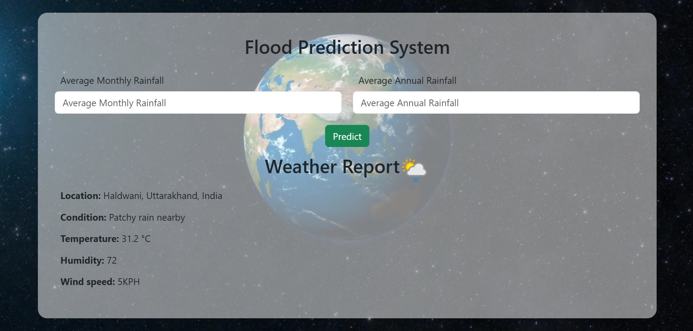

<<<<<<< HEAD
<div align = "center">


# Flood Prediction UI/UX

Flood Prediction UI is a web user interface made using HTML, CSS, JS, and BootStrap and, can be incorporated with backend for Machine Learning(ML/AI) projects. It also uses free WeatherApi and browser GeoLocation API to fetch the user's current location weather. Do not forget to 'star'⭐ the repository, if you like the UI.



</div>

# Installation

- Clone the project

```bash
  git clone https://github.com/sandeepbanoula/FloodPrediction.git
```

- Go to the project directory

```bash
  cd FloodPrediction
```
- Create a config.js file inside the 'js' folder and paste the below code inside.

```bash
  cd js
```

```bash
  const config = {
    apiKey: PASTE YOUR WEATHER_API KEY
    }
```

- Paste your free WeatherApi key from https://www.weatherapi.com/my/ in the config.js file.

```bash
  https://www.weatherapi.com/my/
```
- Open index.html or run live server.

## Contributors ✨

Contributions are always welcome!

<table>
  <tr>
    <td align="center"><a href="https://github.com/sandeepbanoula" target="_blank"><br /><sub><b>Sandeep Banoula</b></sub></a><br /></td>
  </tr>
</table>
=======
# Natural Disaster Analysis and Prediction 

## About the Project  
This project focuses on analyzing and predicting natural disasters using machine learning techniques to aid in early warnings and disaster management strategies.  


Tech Stack: Python, scikit-learn, TensorFlow, Pandas, NumPy, Matplotlib, Flask

The project aim is to analyze patterns and predict natural disasters in India using machine learning models, thereby aiding in early warning systems and disaster management.

This project involves analyzing historical disaster data to understand trends and predict future occurrences. Data preprocessing includes handling missing values and feature engineering. Machine learning algorithms like KNN, Logistic Regression, and Random Forest are implemented to predict disasters with high accuracy. The project also includes data visualization to highlight patterns and a web application for user-friendly interaction, enabling real-time predictions and insights for disaster preparedness.


This project shows how machine learning and data can improve flood prediction and make it more accessible. Using a Random Forest model and Flask, combined with rainfall data and location data, the system makes flood predictions easy to understand and use. The alert system warns people if rainfall crosses safe levels, giving them time to prepare and reducing flood risks. Our project highlights the importance of data-driven solutions in addressing climate-related challenges, paving the way for more sustainable disaster management systems.


**Proposed System – Work Flow**


**We have used the Machine Learning Algorithms like KNN, Logistic Regression, Decision Tree, Random Forest.

The Random Forest got more accuracy so, I have taken the Random Forest and created a Data Acqusation Pipeline and implemented the Flask for deployment of the ML project.

**


Website Images:-


# Natural Disaster Analysis and Prediction  


## Group Members  
- **Mohitha Bandi** (22WU0105037)  
- **Pilla Bhavya** (22WU0105020)  
- **Y. Siddhartha Reddy** (22WU0105028)  
- **T. Harshavardhan Reddy** (22WU0105023)  

## Note  

We are in the process of writing a research paper based on this project. As a result, no code or additional details have been shared in this repository. Please stay tuned for updates!  


>>>>>>> a25cb4f73225d90d21e7db1d53535128f6955295
